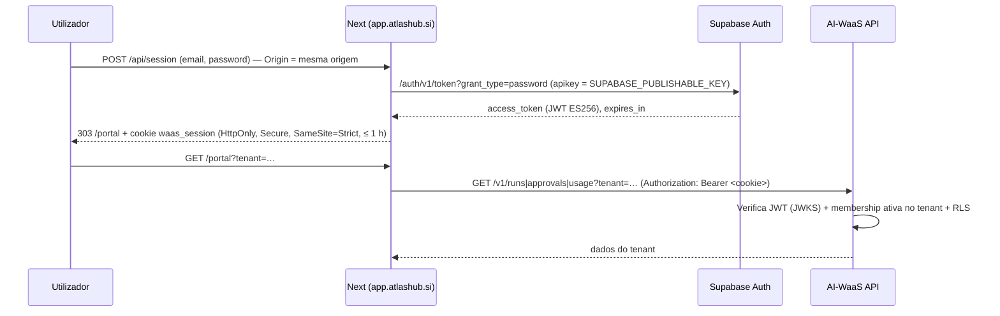

# Arquitetura — app.atlashub.si

Next.js 16 (App Router), React 19, Tailwind 4, TypeScript estrito, Vercel (projeto `app-atlashub-si`, `main` → produção). Sem base de dados própria: o servidor Next só faz de **BFF** (chama a API do AI-WaaS e o Supabase Auth com segredos do lado servidor).

## 1. Rotas

| Rota | Grupo | Renderização | Natureza dos dados | Chama backend? |
|---|---|---|---|---|
| `/` Painel | `(demo)` | estática | **Ilustrativa** (`src/data/mockups/dashboard.json`) | Não |
| `/biblioteca` | `(demo)` | estática | **Ilustrativa** (`src/data/mockups/agent-library.json`) | Não |
| `/packs` | `(site)` | estática | Catálogo real dos packs (`src/data/catalog.json`, v0.3.0) | Não |
| `/simulador/[slug]` | `(site)` | estática (8 slugs) | Simulação em guião + métricas (`src/lib/metrics.ts`) | Não |
| `/assessment` | `(site)` | dinâmica | Formulário → server action | **Sim** `POST /v1/assessments` |
| `/login` | `(site)` | estática | Formulário → `POST /api/session` | **Sim** Supabase Auth |
| `/portal` | `(site)` | dinâmica | Execuções, aprovações, consumo do tenant | **Sim** `/v1/runs`, `/v1/approvals`, `/v1/usage`, `/v1/approvals/{id}/decide` |
| `POST /api/session` | API | Node | Password grant Supabase → cookie | **Sim** |
| `POST /api/logout` | API | Node | Apaga cookie | Não |

## 2. Três naturezas de dados (não misturar)

1. **Ilustrativa** — Painel e Biblioteca reproduzem as maquetes para apresentar a clientes (decisão da direção, 08/10/2026). Os números ("12.480 tarefas", "96 %") não são medidos. Ligar a dados reais = trabalho novo, ver [MAPA-DADOS-ECRAS.md](MAPA-DADOS-ECRAS.md).
2. **Simulação** — simuladores: guião determinístico do pack, sem LLM, nada enviado. As métricas são hipóteses calculadas com os números do visitante e mostram sempre o `disclaimer`. `metrics.ts` tem de se comportar como `atlas-agent-packs/lib/metrics.mjs`.
3. **Real** — assessment, login e portal falam com o AI-WaaS. Só dados de staging sintéticos até homologação.

## 3. Autenticação e sessão

- O JWT nunca chega ao JavaScript do browser (cookie HttpOnly, lido só no servidor).
- **Sem refresh token**: ao fim de ≤ 1 h o utilizador volta ao login.
- O tenant é escrito à mão pelo utilizador (lacuna — ver backlog).
- `service_role` nunca é usado pelo app.

## 4. Fluxos que saem para o WhatsApp oficial

Sem backend, por desenho: "Marcar AI Business Assessment" (resumo da simulação na mensagem), "Falar connosco" (cabeçalho), "Prefere falar já?" (assessment), "Ainda não tem acesso?" (login), "Integrações" (painel/biblioteca). Número em `src/config/site.ts` (`NEXT_PUBLIC_WHATSAPP_NUMBER`).
